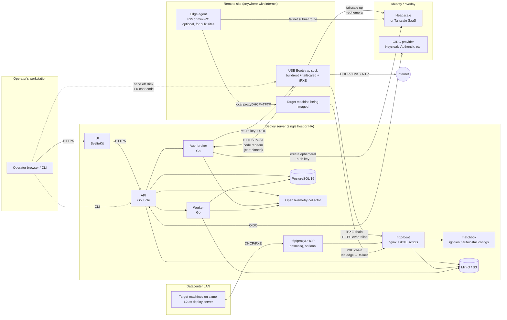
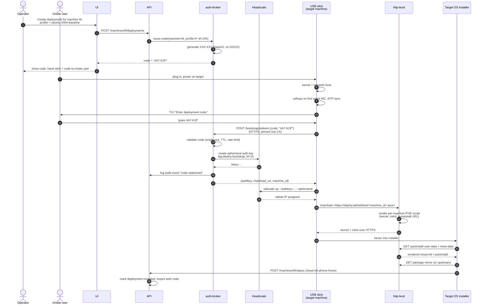
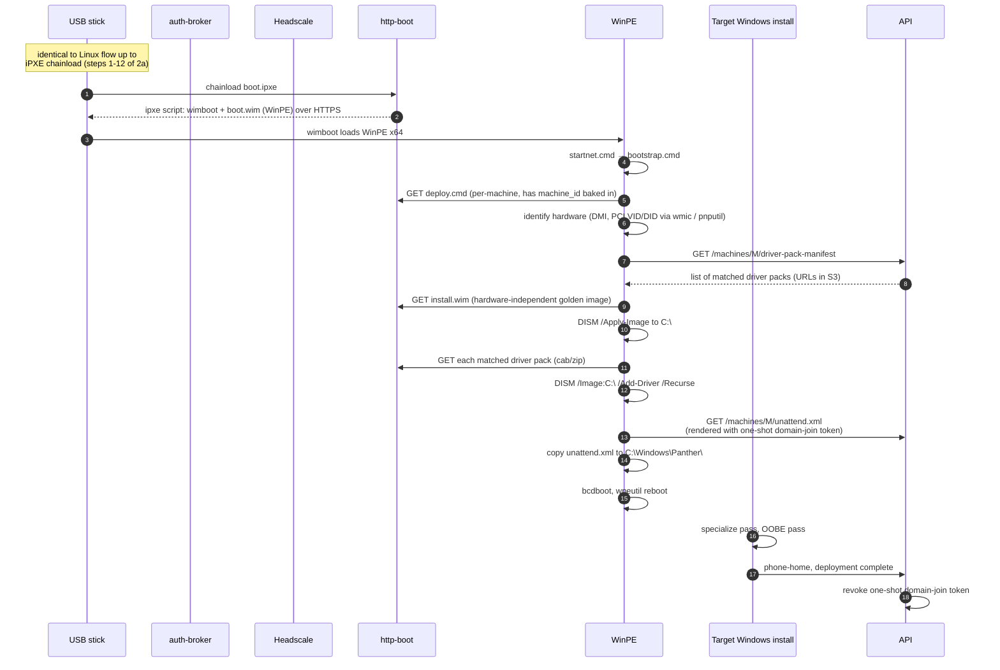
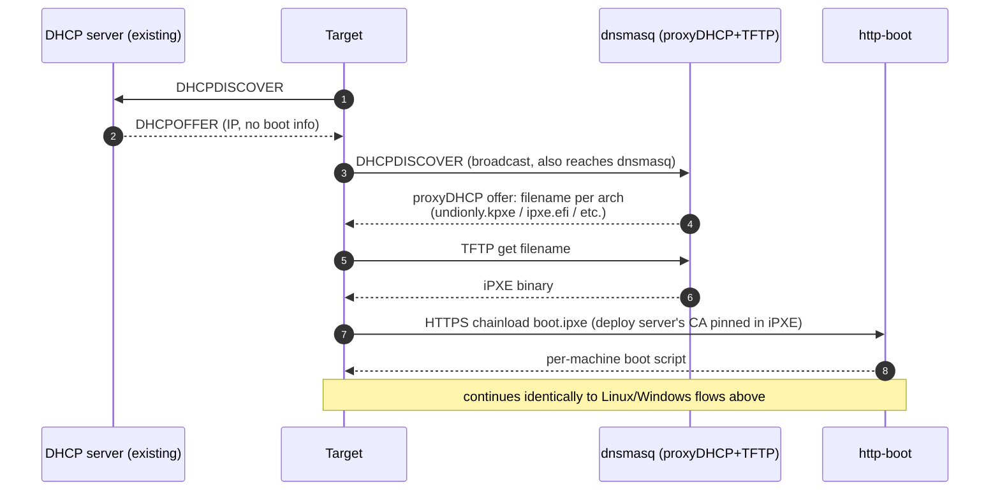
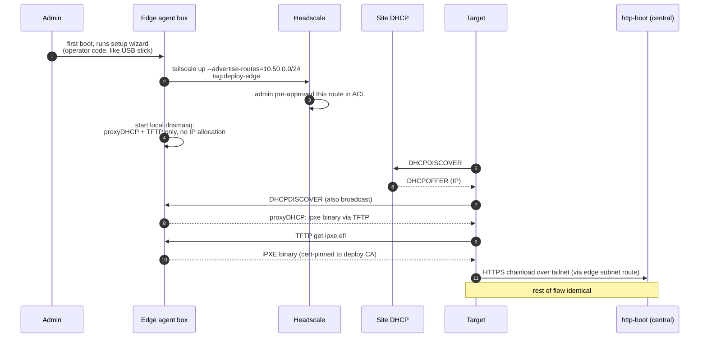
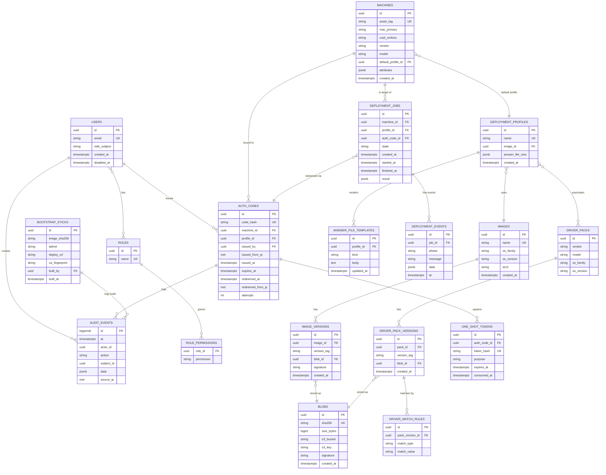

# Architecture

This document is the locked-in design contract. Every component below has a
chosen tool, a pinned version, and a rejected alternative. Before changing a
component choice, update the decision log at the bottom.

## 1. Component diagram

## 2. Sequence diagrams

### 2a. USB bootstrap → Linux deploy (the primary path)

### 2b. USB bootstrap → Windows deploy

### 2c. LAN PXE deploy (datacenter)

### 2d. Edge agent: bulk remote site

## 3. Data model (Postgres)

Notes on the data model:

- `auth_codes.code_hash` stores `argon2id(code)` — the cleartext code never
  hits disk. Rate-limit and attempts counter run on the hash.
- `blobs` is the content-addressed store. Same image referenced by multiple
  versions (e.g. cosigned by different keys) shares one blob.
- `audit_events` is append-only at the application layer, *and* mirrored to a
  syslog/file sink (see SECURITY.md) so a Postgres compromise can't erase it.
- `one_shot_tokens` is the mechanism by which an unattended installer pulls
  a domain-join credential exactly once. The token is bound to the
  redeeming `auth_code`, expires at deployment-job completion, and is hashed
  at rest.

## 4. Decision log

Format: **Choice** — why it. Alternative — why not.

### Language / framework

- **API in Go (1.23+)** — single static binary, trivial cross-compile for
  the edge-agent (linux/arm64 and linux/amd64), strong stdlib for HTTPS,
  ergonomic JSON. Alternative: Python FastAPI — rejected because the
  edge-agent and worker need to run on a 1 GB RPi without pulling a Python
  runtime, and we want a single language across services.

- **UI in SvelteKit (2.x)** — small bundle, easy SSR for the operator UI,
  good form ergonomics for the deployment-builder wizard. Alternative:
  Next.js — rejected because we don't need the React ecosystem here and
  Svelte's bundle size matters when the UI is sometimes accessed from
  remote sites over the same tailnet.

### Networking and overlay

- **Headscale (0.26+) as the default overlay control plane** — self-hosted,
  open-source, ACL-compatible with Tailscale's policy syntax. Alternative:
  Tailscale SaaS — *also* supported (the auth-broker abstracts both behind
  a small interface), but Headscale is the recommended default for this
  project so the entire stack is open-source by default. We test against
  both.

- **Tailscale 1.86+ as the node agent** — official, well-maintained, the
  ephemeral-key + tag mechanic we rely on is first-class. No alternative
  considered for the agent itself; ZeroTier and Nebula don't have
  equivalent ephemeral-tagged-node primitives at the time of writing.

### Boot

- **iPXE (commit pinned in `ipxe/Makefile`)** with `DOWNLOAD_PROTO_HTTPS`,
  `NET_PROTO_IPV6`, `IMAGE_TRUST_CMD`, `CERT_CMD`, `NSLOOKUP_CMD` enabled,
  built with the deploy-server CA embedded as a trusted root. Alternative:
  GRUB2 standalone HTTP-boot — rejected because GRUB's HTTP support is
  fragile, its TLS story is worse, and the wimboot path for Windows is
  iPXE-native.

- **shim (15.8) + signed GRUB2 (2.12)** for Secure Boot on the bootstrap
  stick. Shim is shipped unmodified (it's signed by Microsoft); GRUB2 and
  the kernel are signed by a project MOK key that the user enrolls once on
  first boot. Alternative: Microsoft's signed Windows Boot Manager →
  rejected, can only chain to Windows.

- **dnsmasq (2.90)** for the LAN PXE secondary path — runs as proxyDHCP so
  it doesn't fight an existing DHCP server on the LAN, and serves TFTP. We
  also use it inside the edge-agent container for the bulk remote-site
  case. Alternative: ISC Kea — rejected for this role because Kea is heavy
  for proxyDHCP-only use and dnsmasq's TFTP is rock-solid.

### Bootstrap rootfs

- **buildroot (2025.02 LTS)** for the USB stick image — reproducible
  builds, total image-size control, no package-manager surface area at
  runtime, hashed output suitable for stick-image attestation. Alternative:
  Alpine — rejected because we don't need apk at runtime, the static
  busybox + only-the-binaries-we-need posture is smaller and gives us
  fewer moving parts to worry about for Secure Boot signing.

### Storage

- **PostgreSQL 16** for relational state. No alternative seriously
  considered.

- **MinIO (RELEASE.2025-09-07T16-13-09Z)** for S3-compatible object
  storage in the bundled compose stack. Alternative: SeaweedFS — rejected
  because S3 compatibility is the lingua franca and MinIO's operational
  story is simpler at the small/medium tier. For HA, the user is expected
  to point at any S3-compatible service (real S3, Ceph RGW, Garage, etc.).

### Worker / queue

- **In-process job queue backed by Postgres `LISTEN`/`NOTIFY` plus a
  `jobs` table with row-level locking** — operationally cheap, no Redis,
  no Beanstalkd, no separate broker. Alternative: Redis Streams or NATS
  JetStream — rejected because the job throughput here is "tens per
  minute peak", not thousands per second.

### Observability

- **OpenTelemetry collector** as the single ingest, exporting to whatever
  the user runs (Tempo, Jaeger, Prometheus, Loki). We ship an opinionated
  bundled stack as `docker-compose.observability.yml` (Tempo + Prometheus
  + Grafana + Loki) but it's optional.

### Image signing

- **cosign (2.5+)** with keyless signing as the default for non-MS
  artifacts (Linux kernels, initramfs, image WIMs/qcow2s, driver packs).
  Alternative: GPG — rejected because cosign's verification workflow is
  built into our content-addressed blob store and we can attest to
  manifests cleanly. For Windows binaries we don't sign anything; we
  consume Microsoft-signed artifacts.

### Auth

- **OIDC for human users, mTLS for service-to-service, short-lived bearer
  tokens for installer phone-home.** No alternative considered — this is
  the obvious answer.

### Reverse proxy

- **Caddy 2.10+** in front of all HTTPS endpoints. Auto-cert from Let's
  Encrypt for the public side; configurable to use the project's internal
  CA on the tailnet side. Alternative: nginx — rejected for the front
  proxy because Caddy's automatic cert management is one less moving
  part. nginx is still used internally as the static media server in
  `services/http-boot/` because its byte-range and large-file performance
  is best-in-class.

## 5. Trust boundaries (one-pager)

| Boundary | Authentication | Confidentiality | Integrity |
|---|---|---|---|
| Operator browser ↔ UI | OIDC | TLS (Caddy) | TLS |
| UI ↔ API | session cookie + CSRF | TLS | TLS |
| Operator CLI ↔ API | OIDC device-code flow → bearer | TLS | TLS |
| Stick ↔ auth-broker (pre-tailnet) | one-time code (rate-limited) | TLS, **CA pinned** | TLS |
| Stick / target ↔ deploy server (post-tailnet) | tailnet membership + tag | tailnet WireGuard + TLS | TLS |
| Edge-agent ↔ deploy server | tailnet + mTLS | tailnet WireGuard | mTLS |
| API/AB/Worker ↔ Postgres | mTLS or unix socket | mTLS | mTLS |
| API/AB/Worker ↔ MinIO | static creds, KMS-wrapped | TLS | TLS |
| Installer phone-home ↔ API | one-shot bearer (bound to auth_code) | tailnet + TLS | TLS |

## 6. Known limitations (carried into all phases)

1. **Wired-only USB bootstrap in v1.** Wi-Fi requires `iwd` plus firmware
   blobs that push the image past the 300 MB target. A `BOOTSTRAP_PROFILE=fat`
   build target is sketched but not delivered in v1.
2. **ARM64 Windows is documented but not validated** in v1. The amd64
   path is the reference implementation.
3. **Driver-pack curation is the user's responsibility.** We ingest Dell
   Command | Update / HP Image Assistant / Lenovo SUS bundles and match
   them; we don't curate or redistribute them.
4. **Microsoft binaries are never redistributed.** The user provides
   Windows ISOs and ADK; we orchestrate, we do not host.
5. **Secure Boot requires a one-time MOK enrollment per machine** the
   first time the stick boots, unless the user disables Secure Boot. This
   is unavoidable without a Microsoft-signed shim of our own.
6. **Wake-on-LAN is LAN-only**, by definition. The edge-agent can issue
   WOL to its local subnet on operator request.

